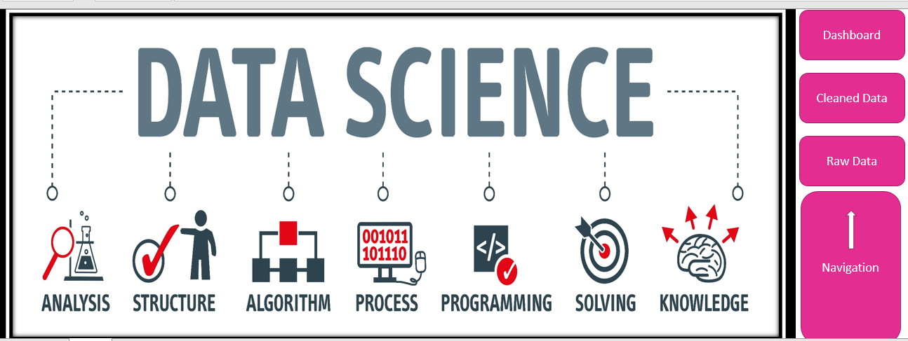

# Data Science Salaries 2023 Analysis 

## Introduction
The vast field of data science continues to spark interest among the tech-savvy population. A report by Davenport and Patil in 2012 termed Data science as the sexiest Job of the twenty-first century.
However, little is known about how the average salary varies by Job title, experience level, city, Work model, etc. Using a dataset obtained from Kaggle on data science salaries in various countries worldwide, I created a report outlining how the average salary of data professionals varies across different attributes.

**_Disclaimer_**: _All datasets and reports do not represent my company, institution, or country. The dataset used for the creation of this report can be found for free on [Kaggle](https://www.kaggle.com/datasets/ruchi798/data-science-job-salaries)_

## Business Objectives:
1.  What is the total average salary of all data professionals worldwide?
2.  What Job titles pay the most salary on average?
3.  Which countries pay the highest salaries to data professionals?
4.  How does the average salary vary by experience level?
5.  Has the average salary of data professionals increased from the year 2020 to date?
6.  Do bugger companies pay more than their medium and smaller-sized counterparts?
7.  How does the average salary vary by Work Model?

## Skills demonstrated
The following Excel Features were incorporated - 
* Macros 
* Dashboard design 
* Pivot Tables and Pivot Charts
* Filters and Filter design
* Data transformation in Excel Power Query
* XLOOKUP Function

## Data Transformation
The raw data were imported into Excel Power Query. The following cleaning Steps were applied:
1. First, I replaced the values in the experience_level column as follows:
    - SE: Was replaced with “Senior”
    - EN: Was replaced with “Entry”
    - EX: Was replaced with “Executive”
    - MI: Was replaced with “Mid/Intermediate”

2.  I replaced the values in the “employment_type” column as follows:
    - FT: Was replaced with “Full-Time”
    - PT: Was replaced with “Part-Time”
    - CT: Was replaced with “Contractor”
    - FL: Was replaced with “Freelancer”
  
3.  I removed the salary and salary currency column since there was another column denoting salary in USD.
4.  I then renamed the “salary_in_usd” to “Salary(USD)” to shorten it.
5.  I then used conditional columns (under the add column tab) to denote the values in the “remote_ratio” column as follows:
    -  0: Onsite
    -  50: Hybrid
    -  100: Fully Remote

6.  I renamed the new column as Work Model which is more befitting, and deleted the old column
7.  I also used a conditional column (under the add column tab) to denote the following values:
    -  L: Large
    -  M: Medium
    -  S: Small

## Problems Encountered
I noticed that the values in the “employee_residence” and “company_location” columns were abbreviated in two letters. Upon further investigation, it was discovered that these were codes for countries. For example, "US" was code for the United States of America, and "AU" was code for Australia.
In other to solve the problem, I explored websites for any files that may have two-letter codes for all countries of the world. I discovered one from databub.io which can be found [here](https://datahub.io/core/country-list). I then imported this country code file into another sheet adjacent to my dataset. Using an XLOOKUP function, I was able to pull in the full country names for each code in my “employee_residence” and “company_location” columns. Finally, my data set was ready for analysis/visualization.

Raw Data              |         
:--------------------:|
       

 Cleaned Data
:-----------------------:

## Data Analysis and Visualization
The analysis steps were carried out in Excel using Pivot Tables and Pivot charts. I then built a dashboard that can be found and interacted with [here](DataScienceSalaries.xlsm). This workbook consists of the following sheets:
1.  The Home Page with some interactive buttons for navigation
2.  The Interactive Dashboard
3.  The raw Data (named Ds_Salaries Unclean)
4.  The cleaned Data (named ds_salaries Cleaned)
5.  Other sheets containing the Pivot tables and pivot charts

### Home Page:

This page contains a welcome picture as well as three buttons for navigation to:
-  Dashboard
-  Cleaned Data
-  Raw Data

### Dashboard:

This page contains the following:
- title
- the filters
- the various interactive pivot charts
- Navigation Panel on the right

### Other workbook components:
These include:
- The raw data as downloaded from Kaggle
- The cleaned data after the raw data was transformed in Excel Power Query
- Other sheets corresponding to the pivot tables and charts

## Insights
1.  The total average salary of the 3755 Data science Job roles surveyed was $137,750
2.  Senior Data roles earn more on average. Thus, the higher a data professional climbs up the career ladder, the more they can be expected to earn
3.  Western nations like the United States of America, Canada, United Kingdom, pay higher salaries
4.  The average salaries of data professionals increase as they garner more work experience
5.  Surprisingly, medium-sized companies pay data professionals higher than large-sized companies
6.  Remor=te and onsite roles pay higher average salaries than hybrid roles. Although this phenomenon requires further investigation
7.  There was a huge spike in the average salaries of data professionals between 2021 and 2022.

## Recommendations
I will recommend a new entrant into the data science field to:
1.  Target medium-sized companies
2.  Target companies located in Western nations like the United States of America, Canada, the United Kingdom, etc.
3.  Gain more experience on the Job to earn higher
4.  Seek remote options due to the flexibility and higher salary associated with these roles

## Limitations of my analysis
1.  The years surveyed were limited. To arrive at a more definite conclusion, data for much previous year (probably from 2013) should have been collected
2.  It seems that most of the data collected were from the United States of America and other Western nations.
3.  The data doesn’t contain skill sets/tools used by the different Job roles which could have provided insights into what skills were needed to earn higher.

